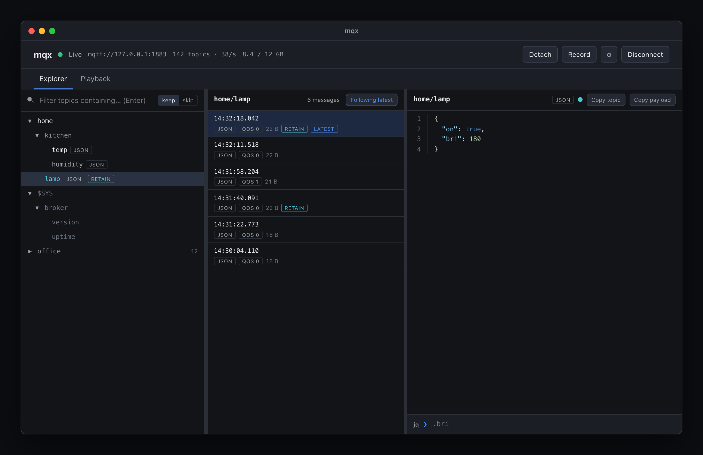
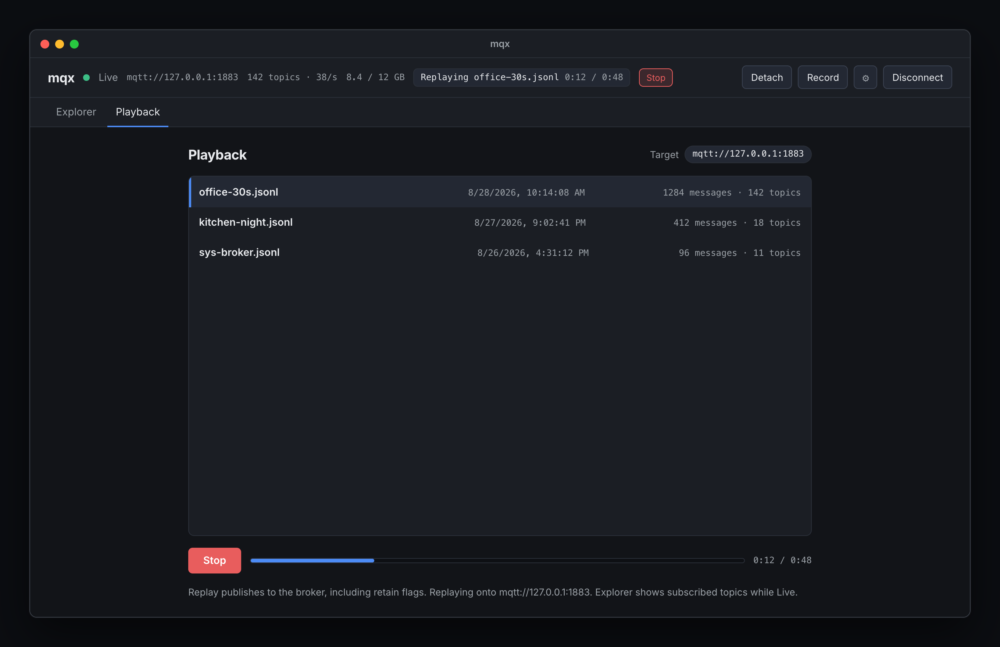

# mqx

mqx is a desktop MQTT explorer. One window is one broker: connect, watch the topic tree fill as messages arrive, inspect payloads, and keep connection profiles (including TLS files) on disk. Passwords use the macOS/Windows keychain or Linux Secret Service, with a permission-protected plaintext file fallback when the keychain is unavailable.

## Explorer

The topic tree fills in as publishes arrive. Search filters paths; pick a topic to scroll its history and inspect the payload. JSON pretty-prints in place, with jq on the same pane.



## Playback

While connected, Record writes mqtt-trace JSONL (raw payloads). Playback publishes a capture onto the broker, including retain flags — that can change retained state on the target. Stay Live to watch the tree, or Detach to freeze the view; replay itself does not flip Live / Detached.



## Install

Release downloads become available after the first verified release is published.

**macOS (Apple Silicon / Intel) and Linux x86_64**

```sh
curl -fsSL https://raw.githubusercontent.com/hauke-gathmann/mqx/main/install.sh | sh
```

The installer verifies release SHA-256 checksums before replacing an existing installation. On macOS it copies the app into `/Applications`, or `~/Applications` if needed. On Linux it installs an AppImage and adds an application-menu entry and icon. No Rust or Node installation is needed.

macOS builds are ad-hoc signed, **without Apple notarization**. If macOS blocks the app, review it in **System Settings → Privacy & Security → Open Anyway**. Managed Macs may prohibit it. The installer does not change Gatekeeper or quarantine settings.

Direct DMG, AppImage, DEB and RPM downloads are on the [releases page](https://github.com/hauke-gathmann/mqx/releases). Target requirements: macOS 13.3+; Linux x86_64 with GTK 3 and WebKitGTK 4.1. Linux ARM64 is not currently built. See [installation troubleshooting](docs/installation.md) for Linux runtime requirements, FUSE, custom locations, specific versions, backups, and removal.

**Windows:** download the NSIS setup EXE or MSI from the releases page. These installers are unsigned and may trigger SmartScreen.

**Live / Detached.** Detach freezes the **view**; Go live applies traffic received in the meantime, still under the RAM cap. Recording continues while Detached.

**Topic history limit.** Settings has a RAM slider (64 MiB–128 GiB, default 512 MiB). Older extra messages drop first; each topic keeps at least its latest payload. That cap is the in-memory topic store, not the whole process.

## Develop

Requires [Rust stable](https://rustup.rs/) and the [Tauri 2 prerequisites](https://v2.tauri.app/start/prerequisites/) for your platform.

```bash
npm ci
npm run tauri dev
```

Layout:

- `ui/` — Vite + Svelte 5 frontend
- `src-tauri/` — Tauri 2 shell and IPC (`mqx` package)
- `crates/mqx-core/` — UI-agnostic profiles, tree, and decode
- `tools/mqtt-trace/` — record/replay MQTT traffic for testing

```bash
npm run check
cargo test -p mqx-core
cargo check -p mqx
```

### MQTT traces

`mqtt-trace` records every publish on a broker to a JSONL file, then replays it with the original inter-arrival times:

```bash
cargo run -p mqtt-trace -- record --broker mqtt://127.0.0.1:1883 -o traffic.jsonl
cargo run -p mqtt-trace -- replay traffic.jsonl --broker mqtt://127.0.0.1:1883
```

Subscribe defaults to `#`. Add `--sys` to include `$SYS/#`. Replay `--speed 1` is real time; `--speed 0` is as fast as possible; `--loop` repeats the trace.

CLI replay of an in-app recording is the same thing as the Playback tab: a traffic dump onto the broker, not a private in-memory view. In-app files start with a header line; `mqtt-trace replay` skips it. Retained publishes in the file are sent as retained.

Profiles are stored under the `mqx` application directory. Theme is stored in `config.toml` (`[ui] theme = "dark" | "light" | "system"`).

Native menus: **mqx**, **Connections**, **Edit**, **View**, **Help**. `Cmd/Ctrl+,` opens settings. `Cmd/Ctrl+K` focuses topic search. `Cmd/Ctrl+Shift+R` toggles recording. Connections has Detach / Go Live / Start/Stop Recording. View switches Explorer and Playback. ↑/↓ steps message history.

## Releases

See the [release runbook](docs/releasing.md) for signing-key setup, release checks, supported-platform verification, and publishing. No Apple Developer ID is required. Release builds use ad-hoc macOS signatures and a separate free key for verified in-app updates.

Every version tag runs the quality checks before packaging and creates a draft. The final verification job checks artifact completeness and updater signatures, and uploads checksums. Publish only after installation tests pass.

Historical design plans are in [docs/plans](docs/plans/). The [readiness assessment](docs/release-readiness.md) records the original review and implementation status.
